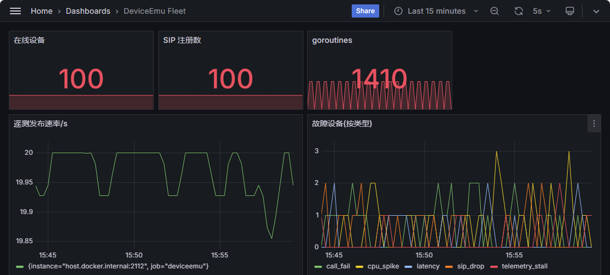
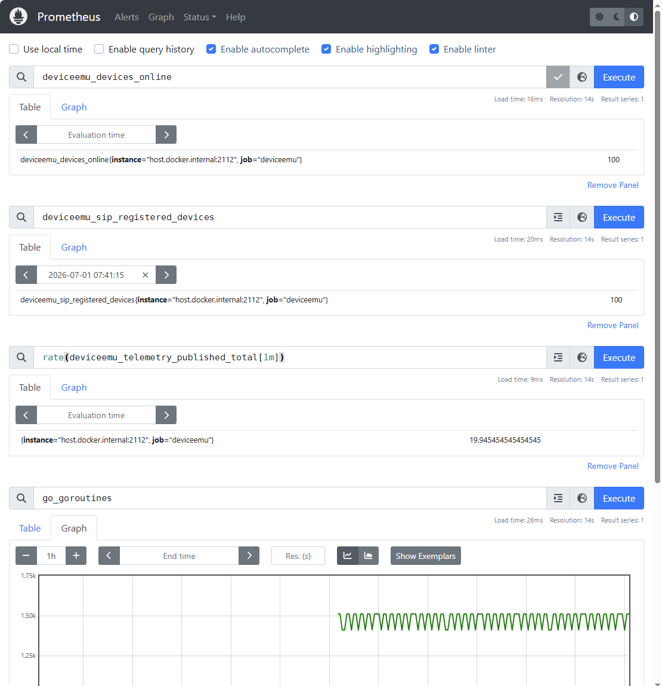

# DeviceEmu Soak 报告(本机仿真，非生产容量）

> 目的：在单机上把设备规模拉到 100，跑约 90 分钟，验证并发注册、遥测吞吐、故障注入/恢复、goroutine 无泄漏。**本报告是可观测性与稳定性验证，不代表生产容量。**

## 环境

- 单进程 `deviceemu`；EMQX / FreeSWITCH 均为本机容器；chaos 开启（每 8s 随机注入一种故障，持续 20s）。
- `fleet.count=100`，遥测间隔 5s，持续约 90min。
- 观测栈：Prometheus 抓取 `deviceemu:2112/metrics`，Grafana 面板 + FreeSWITCH 侧 `fs_cli` 交叉验证。

## 结果

| 指标 | 观测 |
|---|---|
| 在线设备（`deviceemu_devices_online`） | 稳定 100 |
| SIP 注册（`deviceemu_sip_registered_devices`） | 稳定 100，与在线设备一致 |
| 遥测速率（`rate(deviceemu_telemetry_published_total[1m])`） | ≈20 条/s，稳定（100 台 ÷ 5s 间隔 = 理论 20/s，吻合） |
| goroutine（`go_goroutines`） | 稳态约 1510，随 chaos 注入在 1400–1600 间规律振荡，**无持续单调增长（无泄漏）** |
| 故障注入 → 恢复（`deviceemu_devices_faulty`） | 随 chaos 起伏，故障到期后自动归零 |


**判读要点：** goroutine 呈规律锯齿波、有升有回落，与故障注入批次同步 —— 这是"故障期部分 goroutine 短暂增多、恢复后回落"的正常形态。真正的泄漏应表现为单调爬升不回落，本次未出现。

## 瓶颈定位（SIP 侧）

soak 过程中 SIP 注册数受几个上限制约，按影响顺序：

1. **分机数量**：vanilla 默认只有 1000–1019；本镜像构建期用 `gen-users.sh` 烤到 1000–1119（120 个）。要更大规模需改 `gen-users.sh` 的区间参数并重新 build。
2. **本地 UDP 端口段**：每台设备占一个本机监听端口（本次 100 台占 5066–5165）。上千规模需要规划更大端口段，并相应调高 `ulimit -n`。
3. **FreeSWITCH internal profile**：大批设备同时注册会受 ACL / rate-limit 约束，实测靠客户端侧注册退避（RegisterLoop 指数退避）把突发抹平，注册速率曲线因此平滑爬坡而非瞬间到顶。
4. **信令面 vs 数据面的固有差异**：MQTT 侧（EMQX）可继续上量，SIP 侧是本机仿真下的规模天花板 —— 这是真实 IoT 紧急通信场景里"信令面重、数据面轻"的固有特征，不是实现缺陷。

## 复现步骤

```bash
# 1. 起观测栈 + 依赖(EMQX / FreeSWITCH / Prometheus / Grafana)
docker compose -f deploy/docker-compose.yaml up -d

# 2. 提高文件描述符上限(100 台每台 ≥1 socket,几百 fd 够;上千规模需 ulimit -n 4096)
ulimit -n 4096

# 3. 起 100 台设备(config.yaml 里 fleet.count=100)
make run

# 4. 观测注册爬坡
watch -n2 'curl -s localhost:2112/metrics | grep -E "deviceemu_devices_online|deviceemu_sip_registered_devices"'
```

## 验证命令

```bash
# 遥测吞吐(应 ≈20/s)
curl -s localhost:2112/metrics | grep '^deviceemu_telemetry_published_total'

# goroutine 稳态(soak 前后各取一次对比,确认无泄漏)
curl -s localhost:2112/metrics | grep '^go_goroutines'

# 手动注入一波集中故障,看 Grafana 上"故障设备(按类型)"面板起伏与自动恢复
for i in $(seq 1000 1009); do
  mosquitto_pub -h 127.0.0.1 -t devices/device-$i/cmd \
    -m '{"action":"simulate_fault","fault":"sip_drop","duration_seconds":15}'
done
```

> 注：验证注册数请以 Prometheus 的 `deviceemu_sip_registered_devices` 或 Grafana 面板为准。
> 不要用 `fs_cli -x "sofia status profile internal reg" | grep -c "Registrations:"` —— `grep -c` 数的是 "Registrations:" 这个**表头字符串出现的行数**（恒为 1），不是真实注册数。

## 踩过的坑

**1. 僵尸进程占用 metrics 端口 → 面板数值卡死不更新**

异常退出的旧进程未彻底清理，仍占着 `:2112` 并对外提供早已停滞的旧指标；新进程启动时报 `bind: address already in use`，自己的 `/metrics` 起不来，Prometheus 一直抓的是僵尸进程的陈旧数据，Grafana 面板因此卡在一个不变的数值。

- 排查：`lsof -i :2112` 或 `ps aux | grep deviceemu` 找到残留 PID。
- 处理：`kill <PID>`（卡住则 `kill -9 <PID>`），确认 `ps aux | grep deviceemu` 无残留后再重启。
- 教训：进程异常退出后，重启前先确认端口已释放；`bind: address already in use` 是"上一个我还没死干净"的信号，不是配置问题。

**2. Grafana → Prometheus 间歇性 DNS 失败（`server misbehaving`）**

Grafana 面板偶发报 `dial tcp: lookup prometheus on 127.0.0.11:53: server misbehaving`。网络、DNS 地址（`127.0.0.11`）、Compose 服务别名经排查均正确，属 Docker 内嵌 DNS 的间歇性抖动（本机同时跑着 kind 集群，多套 Docker 网络共存，加剧了内嵌 DNS 转发的偶发故障）。

- 缓解：给 Grafana 加静态 hosts 映射，直接绕开 DNS 解析这一层。

```yaml
grafana:
  extra_hosts:
    - "prometheus:<prometheus 容器 IP 或宿主 IP>"
```

- 排查手法记录：容器内 BusyBox 的 `wget` / `getent` 解析结果不可信（`getent hosts` 只查 `/etc/hosts` 不走 DNS，`wget` 报 `bad address` 是工具局限而非真失败）。要看真实错误，用 Grafana 面板的 **Inspect → Error**，那里显示的是应用自身发起请求时捕获的原始异常。
